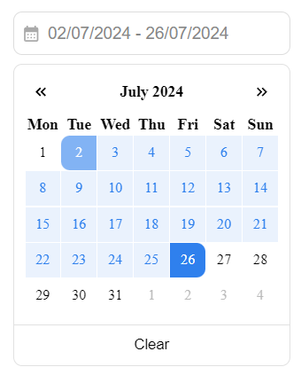
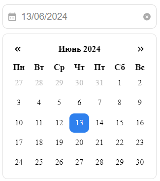
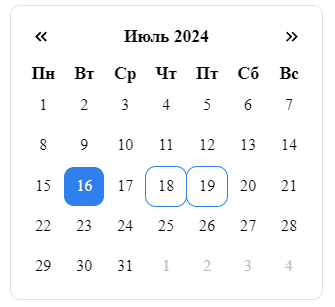
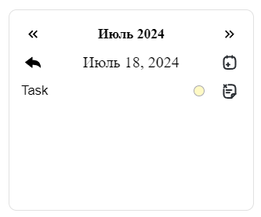

# DatePicker Library

This library provides three main components: RangeDatePicker, DatePicker, and TaskCalendar. These components are designed to help you manage dates and tasks efficiently in React applications.

## Components
### 1. DatePicker
A simple date picker component for selecting a single date.
#### _Props:_
* `selectedDate` (Date): The currently selected date.
* `selectDate` (Function): Callback function to update the selected date.

### 2. RangeDatePicker
A date picker component for selecting a range of dates.
#### _Props:_
* `startDate` (Date): The currently selected start date.
* `endDate` (Date): The currently selected end date.
* `selectDate` (Function): Callback function to update the selected date range.
* `handleFooterClick` (Function): Callback function to handle footer button clicks.
* `isRenderFooter` (Boolean): Whether to render the footer section.
* `footerTitle` (String): The title for the footer button.

### 3. TaskCalendar
A calendar component for managing tasks.
#### _Props:_
* `selectedDate` (Date): The currently selected date.
* `selectDate` (Function): Callback function to update the selected date.
* `isViewTasks` (Boolean): Whether to display tasks.

### Shared Props
These props can be passed to any of the components (`DatePicker`, `RangeDatePicker`, `TaskCalendar`):
- `locale` (String): The locale to use for the calendar. Default is `'default'`. Example `es-US`.
- `firstWeekDay` (String): The first day of the week. Default is `Monday`. Various: `Monday` / `Sunday`
- `maxRangeDate` (Object): The maximum date to display. Default is the start of the current year + 74.
- `minRangeDate` (Object): The minimum date to display. Default is the start of the current year - 74.
- `isShowWeekends` (Boolean): Whether to show weekends.
- `isShowHolidays` (Boolean): Whether to show holidays.
- `holidays` (Array): An array of holidays.
- `holidayColor` (String): Color of holidays (hex/rgb/rgba string). Default is ```#E1E1E1```

### Holidays Prop Example:
```
export const Holidays: HolidayType[] = [
  { name: 'День Конституции', month: 3, day: 15 },
  { name: 'День единения народов Беларуси и России', month: 4, day: 2 },
  { name: 'День Победы', month: 5, day: 9 },
  { name: 'День Независимости Республики Беларусь (День Республики)', month: 7, day: 3 },
  { name: 'День народного единства', month: 9, day: 17 },
  { name: 'Новый год', month: 1, day: 1 },
  { name: 'День защитников Отечества и Вооруженных Сил Республики Беларусь', month: 2, day: 23 },
  { name: 'День женщин', month: 3, day: 8 },
  { name: 'Праздник труда', month: 3, day: 1 },
  { name: 'День Октябрьской революции', month: 11, day: 7 },
  { name: 'Рождество Христово (православное Рождество)', month: 1, day: 7 },
  { name: 'Рождество Христово (католическое Рождество)', month: 12, day: 25 },
];
```
### MaxRangeDate / MinRangeDate Prop Example:
```
minRangeDate = { year: new Date().getFullYear() - 74, month: 12, day: 1 },
maxRangeDate = { year: new Date().getFullYear() + 74, month: 12, day: 1 },
```

## Installation Steps

1. First, you need to install the library:
```
npm install @vmang0/datepicker-lib
```
or
```
yarn add @vmang0/datepicker-lib
```
2. In general, you can already use input and calendar to work with dates. For example: 
```
import { DatePicker, RangeDatePicker, TaskCalendar } from '@vmang0/datepicker-lib';

<DatePicker />
<RangeDatePicker />
<TaskCalendar />
```

## Screenshots: 
### 1. Range Datepicker


### 2. Default Datepicker


### 3. Task Calendar





